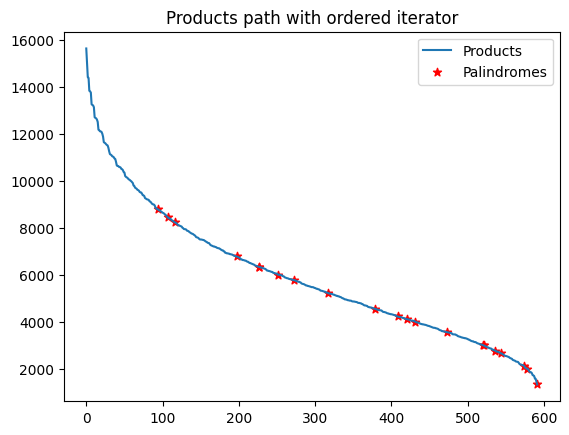
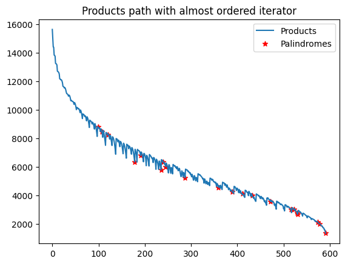

# Usage

### Within a conda env
```console
$ conda create -n <env_name> python=3.10
$ conda activate <env_name>
$ pip install -r requirements.txt

```
### With docker
"raise NotImplementedYetError"


# The problem

The problem is to find the biggest palindrom $p$ with
$$p = a_0\times a_1\times \dots \times a_{n-1}$$
and
$$a_i\in [ m, M ]$$


For each solution , the idea is to iterate within the cartesian product $[ m, M ]^n$. An other solution might be to iterate over all palindromes between $a_{max}$ and $a_{min}$ and it will probably be implemented soon.

Before solving the actual problem with $m=100,\ M=999$ and $n=3$, we'll use $m=11,\ M=25$ and $n=3$ for visualisation.


```python
import matplotlib.pyplot as plt
from combinations import Combination
from iterators import (
    get_naive_iterator, 
    get_pruned_iterator, 
    get_ordered_iterator)

def plot_iterator(iterator, title=""):
    products = []
    palindromes_x = []
    palindromes_y = []

    for i, combination in enumerate(iterator):
        combination = Combination(combination)
        if combination.is_palindrome():
            palindromes_x.append(i)
            palindromes_y.append(combination.product)
        products.append(combination.product)

    plt.plot(products, label="Products")
    plt.scatter(palindromes_x, palindromes_y, c='r',
                marker="*", label="Palindromes")
    plt.title(title)
    plt.legend()
    
min_digit, max_digit, n_digits = 11, 25, 3

```

# Brute force solution using a naive iterator

This solution simply involve nested for loops within the cartesian product $[ m, M ]^n$. It avoids duplicates by ordering each $(a, b, c)$ such as $a\geq b\geq c$.

As we can see on the figure below, this iterator must be consumed entirely before return the biggest palindrome which will result in a big amount of time to compute the solution.


```python
naive_iterator = get_naive_iterator(min_digit, max_digit, n_digits)
plot_iterator(
    naive_iterator,
    title="Products path with naive iterator")

```


    

    


# Brute Force solution with pruning

The idea here is that we won't iterate threw $(a, b, c)$ if their product $abc$ is less than the last encountered palindrome. 
This solution will be really faster but can't be used to find all the palindromes.


```python
pruned_iterator = get_pruned_iterator(min_digit, max_digit)
plot_iterator(
    pruned_iterator,
    title="Products path with pruned iterator")

```


    

    


# First match with a decreasing iterator

The idea here is te iterate within $[ m, M ]^n$ in a way such that the sequence of the $(a,b,c)$ is decreasing.

To accomplish that, we consider the tree where each node $(a, b, c)$ has three children which are the combinations with the biggest product smaller than $abc$.

We might then process Breadth First Search (BFS) against that tree and stop at the first palindrome encoutered. Actually it may not return the biggest one as a it will not provide a decreasing sequence of combinations.


```python
ordered_iterator = get_ordered_iterator(
    min_digit, max_digit, n_digits, almost=True)
plot_iterator(
    ordered_iterator,
    title="Products path with almost ordered iterator")


```


    

    


To avoid this, we'll need to compute a little bit ahead of time the next layer of the tree and merge it with the currently processed layer while preserving the decreasing order.

The great advantage of this iterator, aside his speed of execution, is that the first palindrome is the one we looking for.


```python
ordered_iterator = get_ordered_iterator(
    min_digit, max_digit, n_digits, almost=False)
plot_iterator(
    ordered_iterator,
    title="Products path with ordered iterator")

```


    

    


# Performances


```python
from finders import NaiveFinder, PrunedFinder, OrderedFinder
from time import perf_counter
```


```python
def perfs(finder):
    t = perf_counter()
    p = finder.find()
    return p, perf_counter() - t


min_digit, max_digit = 100, 999
naive_finder = NaiveFinder(min_digit, max_digit)
pruned_finder = PrunedFinder(min_digit, max_digit)
ordered_finder = OrderedFinder(min_digit, max_digit)

print("naive", *perfs(naive_finder))
print("pruned", *perfs(pruned_finder))
print("ordered :", *perfs(ordered_finder))

```

    naive (967262769, 123.83732125100505)
    pruned (967262769, 0.37509871399379335)
    ordered : 967262769 0.0064202840003417805

