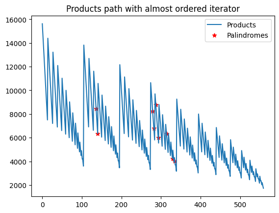
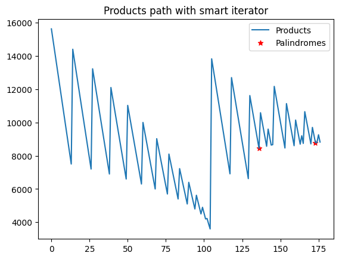
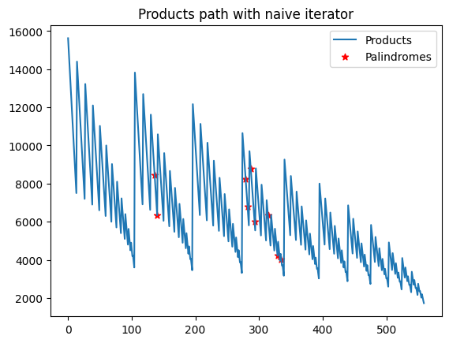

```python
from iterators import get_naive_iterator, get_pruned_iterator, get_almost_ordered_iterator, plot_iterator
```


```python


min_digit, max_digit, n_digits = 11, 25, 3

naive_iterator = get_naive_iterator(min_digit, max_digit, n_digits)

plot_iterator(
    naive_iterator,
    title="Products path with almost ordered iterator")

```


    

    


```python
pruned_iterator = get_pruned_iterator(min_digit, max_digit)
plot_iterator(
    pruned_iterator,
    title="Products path with smart iterator")

```


    

    


```python
ordered_iterator = get_almost_ordered_iterator(
    min_digit, max_digit, n_digits)
plot_iterator(
    ordered_iterator,
    title="Products path with almost ordered iterator")


```


    

    


```python
ordered_iterator = get_almost_ordered_iterator(
    min_digit, max_digit, n_digits, almost=False)
plot_iterator(
    ordered_iterator,
    title="Products path with ordered iterator")

```


    

    


```python

```
